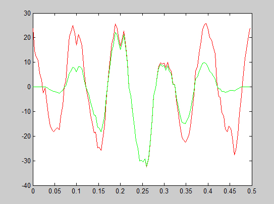
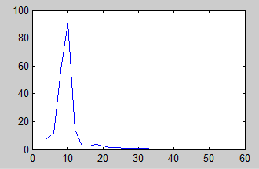
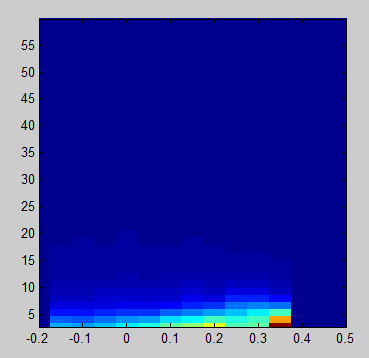
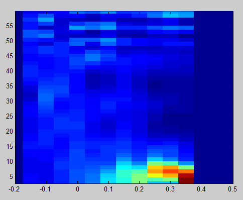

## Plan jazdy
* sprawy organizacyjne
* test z materiału z ostatnich dwóch zajęć
* krótka powtórka
* analizy czas-częstość, krótki wstęp
* przeprowadzanie analizy czas-częstość w fieldtripie
* statystyki na wynikach czas-częstość - cluster-correction

## Sprawy organizacyjne
* lista!
* kiedy umawiamy się na poprawy?
* jak ktoś nie zdażył pracy domowej - jeszcze do końca tego tygodnia będę akceptował
* do końca następnego - to samo co, ostatnio, ale na danych czas-częstość (dla wybranej elektrody czas-częstość a następnie analiza statystyczna)

## krótka potestowa powtórka:
* co robi licz_stat?
  możecie zajrzeć do tego pliku następującą komendą:
  ```matlab
  edit licz_stat
  ```
* co robi `get_cluster_cfg`
  w `licz_stat` dzięki tej funkcji otrzymujemy cfg, które podajemy do ft_timelockedstatistics.
  Zerkniemy do środka `get_cluster_cfg` i sprawdzimy jakie `cfg` nam tworzy
* co znaczą wybrane atrybuty z cfg


## ft_freqanalysis

Do analiz częstotliwościowych używamy funkcji `fr_freqanalysis`, jej dokumentację znajdziemy [w internetu głębi](http://www.fieldtriptoolbox.org/reference/ft_freqanalysis) oraz wykonując komendę:
```matlab
doc ft_freqanalysis
```

Jak zawsze w przypadku funkcji fieldtripowych oprócz danych potrzebujemy struktury konfiguracyjnej, którą zwykle przetrzymujemy w zmiennej `cfg`

### Rach-ciach, wczytujemy dane
Jak zwykle, zakładając, że jesteście w już folderze `wombat`:
```matlab
cd dane-twarze
fls = dir('*.set')

% weźmy na przykład piąty plik
file_num = 5;
EEG = pop_loadset(fls(file_num).name);
% konwertujemy na format fieldtripowy
eeg = eeg2ftrip(EEG);
```

### Widmo
Najpierw spróbujemy po prostu widmo, czyli zawartość różnych częstotliwości w sygnale niezależnie od czasu. 

#### komenda
Tworzymy strukturę `cfg` i używamy funkcji `ft_freqanalysis`:
```matlab
cfg.method  = 'mtmfft';
cfg.channel = 'E47';
cfg.foilim  = [3, 60];
cfg.taper   = 'hanning';

widmo = ft_freqanalysis(cfg, eeg);
```

#### opis parametrów
Co znaczą te wszystkie parametry? Po kolei:
- `method` - metoda, której używamy do oszacowania częstotliwości. Użyte przez nas `'mtmfft'` oznacza "multitapering fast fourier transform". Faktycznie, ze względu na podawany parametr `taper` korzystamy ze zwykłej transformaty Fouriera. Jeżeli nie rozumiesz o co chodzi - nie przejmuj się, nie omawialiśmy (niestety) transformaty Fouriera na zajęciach.
- `channel` - kanał (bądź kanały), które chcemy przeanalizować
- `foilim` - zakres częstotliwości które nas interesują. `[3, 60]` znaczy oczywiście *"od 3 do 60 Hz"*
- `taper` - jakim okienkiem wygładzamy sygnał. Nigdy nie bierzemy żywcem wyciętego z danych sygnału - na krawędziach będziemy często mieć wartości różne od zera co może być źródłem artefaktów (szczególnie w połączeniu z zero-padding, o którym również nie mówimy na zajęciach :P). Aby temu zaradzić - sygnał jest wygładzany okienkiem, które wygląda zwykle podobnie do rozkładu gaussa. Możecie zobaczyć sobie jak takie okienko wygląda:
  ```matlab
  % rysujemy sobie okienko długości 250 próbek
  plot(hanning(250));
  ```
  [tutaj obrazek]

  Zobaczmy też jaki jest efekt wygładzenia. Na wykresie rysujemy sygnał oryginalny (czerwony) oraz sygnał wygładzony okienkiem (zielony):
  ```matlab
  % tworzymy pusty wykres
  figure;
  % rysujemy sygnał z 5 epoki, 38 elektrody:
  plot(eeg.time{5}, eeg.trial{5}(38, :), 'r')
  % sprawdzamy długość sygnału
  signal_length = size(eeg.trial{5}(38, :), 2);
  % tworzymy okienko hanning tej samej długości:
  okienko = hanning(signal_length);
  % wygładzmy okienkiem sygnał (przemnażamy kolejne punkty
  % sygnału kolejnymi punktami okienka)
  wygladzony = eeg.trial{5}(38,:) .* okienko';
  % rysujemy wygładzony sygnał
  hold on; plot(eeg.time{5}, wygladzony, 'g');
  ```
  

#### output
Zajrzyjmy sobie do tego, co przechowuje teraz zmienna `widmo`:
```
>> widmo
widmo = 
        label: {'E47'}
       dimord: 'chan_freq'
         freq: [1x29 double]
    powspctrm: [1x29 double]
         elec: [1x1 struct]
          cfg: [1x1 struct]
```

W polu `freq` mamy informację o częstotliwości (w Hz) kolejnych punktów częstotliwościowych. W `powspctrm` (skrót od *power spectrum*) jest natomiast moc sygnału (amplituda podniesiona do kwadratu). `dimord` mówi nam jakie są wymiary danych obecnych w `powspctrm` - `chan_freq` czyli kanały na częstotliwości. Widzimy, że rozmiar `powspctrm` to [1x29] - jeden kanał, 29 częstotliwości. W `label` mamy informacje o nazwach elektrod. 

#### Rysujemy widmo
```matlab
plot(widmo.freq, widmo.powspctrm);
```



#### dodatkowe opcje w `cfg`
Możemy podać cały wektor interesujących nas częstotliwości:
```matlab
cfg.foi = [3:0.5:25];
```
Gdy natomiast chcemy otrzymać widmo dla każdego triala (a nie tylko średnią) piszemy:
```matlab
cfg.keeptrials = 'yes';
```

### Czas częstość:

#### komenda
```matlab
cfg = [];
cfg.method    ='mtmconvol';
cfg.taper     = 'hanning';
cfg.toi       = [-0.2:0.05:0.5];
cfg.foi       = [3:60];
cfg.t_ftimwin = 0.2;

tfr = ft_freqanalysis(cfg, eeg);
```

:warning: Jeżeli wywala Ci się powyższa komenda - znaczy to prawdopodobnie, że masz nowego fieldtripa, w którym mógł wkraść się błąd (FieldTrip jest wypuszczany codziennie, więc w zależności od dnia gdy ściągamy/update'ujemy fieldtripa możemy czasem trafić na jakiegoś bug'a). Aby obejść błąd uzupełnij `cfg` o:
```matlab
cfg.t_ftimwin = repmat([0.2], [1, length(cfg.foi)]);
```

#### opis parametrów
- `method`, znów, metoda której używamy. `mtmconvol` - przede wszystkim - "convol" od convolution czyli splotu - operacji, o której nie mówiliśmy, a która jest podstawą liczenia zmian czestotliwości w czasie. Wystarczy, że będziecie pamiętac, że `mtmconvol` jest do czasu-częstości a `mtmfft` do czestotliwości po prostu.
- `taper` - jak wcześniej, okienko. Tyle że teraz okienko będzie przesuwać się w czasie (patrz `cfg.toi`)
- `toi` - *time(s) of interest* - wektor czasów, które nas interesują. Faktycznie każdy z takich punktów czasowych to środek okienka, którym sprawdzamy zawartość czestotliwościową sygnału.
- `foi` - *frequenc(y/ies) of interest* = wektor częstotliwości, które chcemy sprawdzić
- `t_ftimwin` - długośc okienka, którym idziemy przez sygnał. Wartość ta może być różna dla różnych częstotliwości, które nas interesują. Np `cfg.t_ftimwin = 1/cfg.foi * 3;` daje dla każdej częstotliwości długość okienka równą długości trzech cykli danej częstotliwości.

#### rysujemy czas-częstość
Możemy napisać własną funkcję do rysowania czasu-częstości:
```matlab
function plot_tfr(tfr, chan)

% plotujemy
im = imagesc(squeeze(tfr.powspctrm(chan,:,:)));

% ustawiamy osie itp.
set(gca, 'YDir', 'normal');
set(im, 'XData', tfr.time([1,end]));
set(im, 'YData', tfr.freq([1,end]));
set(gca, 'XLim', tfr.time([1,end]));
set(gca, 'YLim', tfr.freq([1,end]));
```

Gdy zapiszemy powyższą funkcję to (pod warunkiem, że jest ona na ścieżce matlaba) pisząc:
```matlab
plot_tfr(tfr, 1);
```
Otrzymamy taki wykres:  


Na razie dużo nie widać. Z dwóch powodów:
1. Patrzymy na moc absolutną - a nie na zmiany względem prezentacji bodźca.
2. Sygnał jest niezlogarytmizowany, więc niewiele widać w wyższych częstotliwościach.

Logarytmizację zostawimy sobie na kiedy indziej. Chcemy zobaczyć zmiany względem pojawienia się bodźca - czas więc na baseline correction!

#### baseline correction
Tak jak robiliśmy korektę aby oglądać potencjały wywołane traktując to, co dzieje się przed bodźcem jako nasze odniesienie (nasz punkt zero) - tak też możemy korektę zrobić teraz.
Metod baseline'u dla danych czas-częstość jest sporo - możemy patrzeć na różnicę względem czasu sprzed bodźca, na procentowy wzrost/spadek, bądź wzrost/spadek opisywany w odchyleniach standardowych aktywności sprzed poajwienia się bodźca albo też zmianę opisywaną w dB itp. Aby nie komplikować nadmiernie tego kroku skupimy się zmianie procentowej.
W FieldTripie do przeprowadzenia baseline'u służy nam funkcja `ft_freqbaseline`:
```matlab
cfg = [];
cfg.baseline = [-0.25, 0];
cfg.baselinetype = 'relchange';

tfr_bsl = ft_freqbaseline(cfg, tfr);
```
`cfg.baseline` opisuje nam czas względem którego chcemy obserwować zmiany, natomist `cfg.baselinetype` pozwala określić rodzaj baseline'u. Wybralismy opcję `'relchange'`, która opisuje procentową zmianę.

Wyplotujmy teraz `tfr_bls`:
```matlab
plot(tfr_bsl, 1);
```



Widzimy wzrost niskich częstotliwości po prezentacji bodźca (to jest to, czego część obserwujemy jako ERPa - ERP to przede wszystkim aktywność w niskich częstotliwościach). Widzimy też spadek częstotliwości wyższych. Ostatecznie interesuje nas różnica w tych zmianach częstotliwościowych w czasie w zależności od warunku, któremu poddana jest osoba badana!

### pętla przez osoby i statystyki
Zadanie dla Was! :) (praca domowa! - nie zdążylimy na zajęciach dojsć tu)
Będę Wam pomagał trochę:
* pętlę przez osoby robiliśmy już wiele razy, także to zróbcie samodzielnie
* pamiętajcie, że chcemy skontrastować jakieś dwa warunki - `ktory_war` się przyda!
* do statystyk skorzystajcie z tego co zobaczyliście w środku `licz_stat`: przede wszystkim `get_cluster_cfg`. Cluster-correction zrobicie funkcją `ft_freqstatistics`

### Wizualiazacja efektu
*Coming soon*
